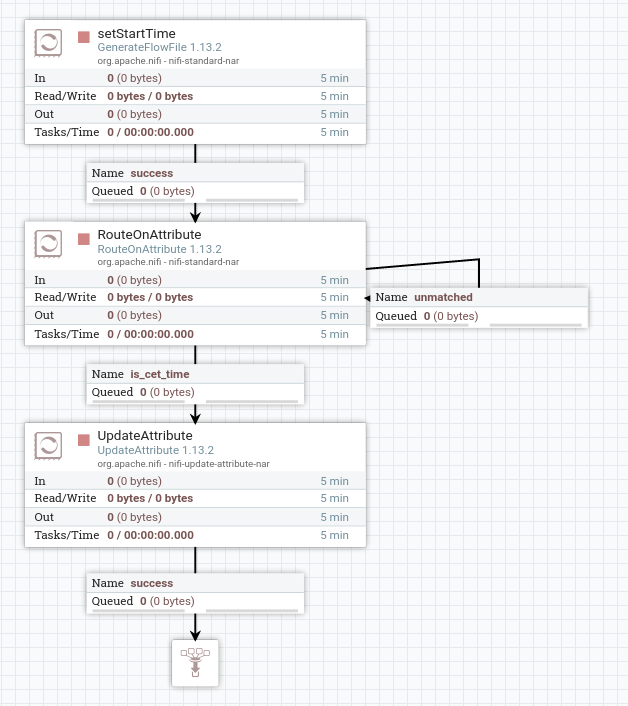

##

If we have to run Nifi in UTC timezone and want to start the pipeline in local time.
Set a planned execution time in CET (or any other timezone) and the script waits until the start time matches the set time.

-- Tested with Nifi 1.13.2

